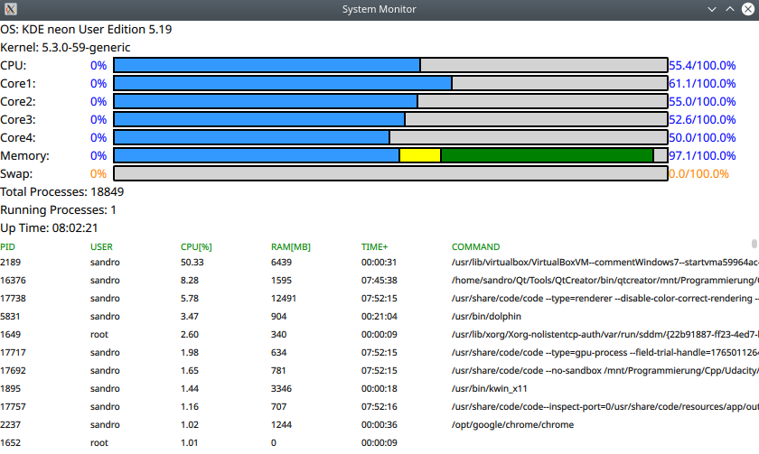

# System-Monitor

# Features:
* Displays the utilization of all cores of the CPU
* Displays memory consumption
* Displays all currently running processes. Sorted by the most hungry processes.
* Displays both "system" and "kernel" version
* Displays "system" uptime

Currently application runs only with linux. I plan to add windows support later.

## Dependencies for Running Locally

* QT >= 5.15 
  * You can download QT [here](https://www.qt.io/download). Developed under QT Creator

## License

This project is licensed under the GPL3 License - see the [LICENSE.md](LICENSE.md) file for details
